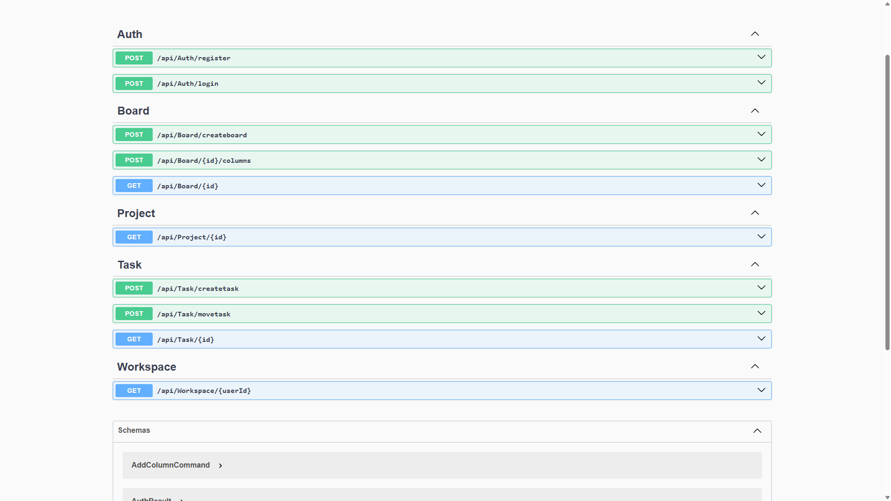
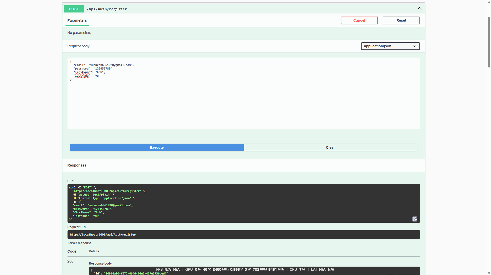
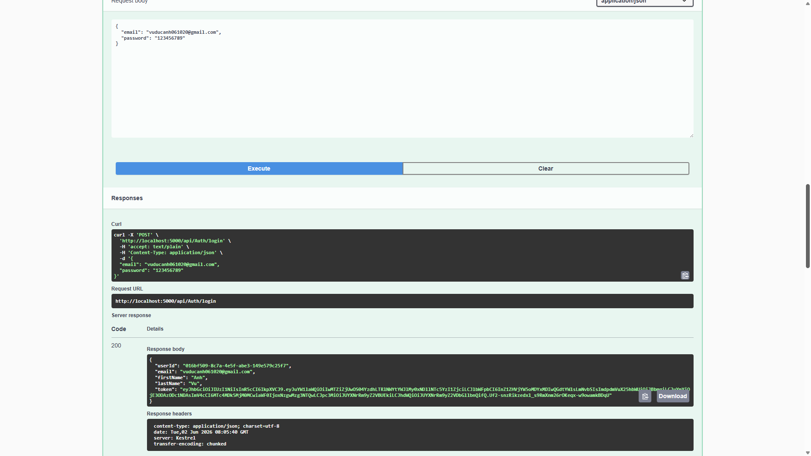
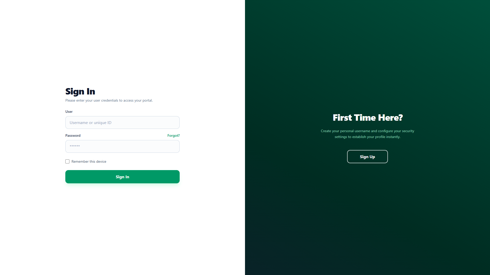
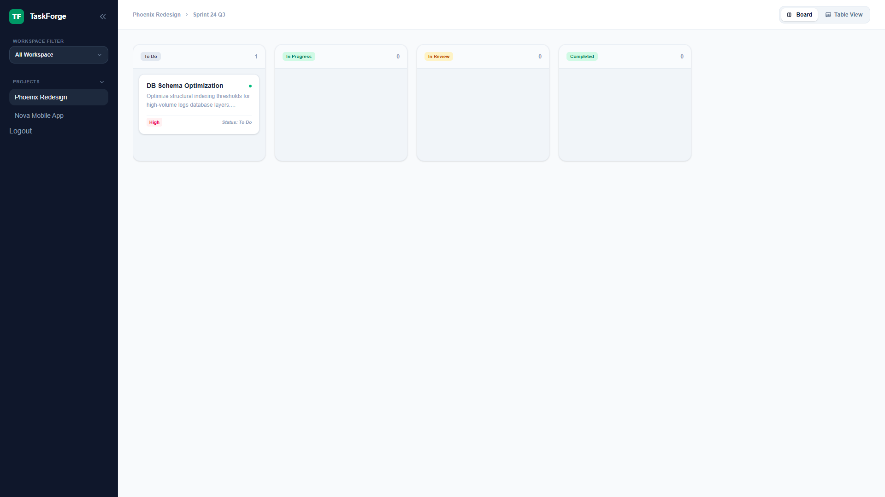
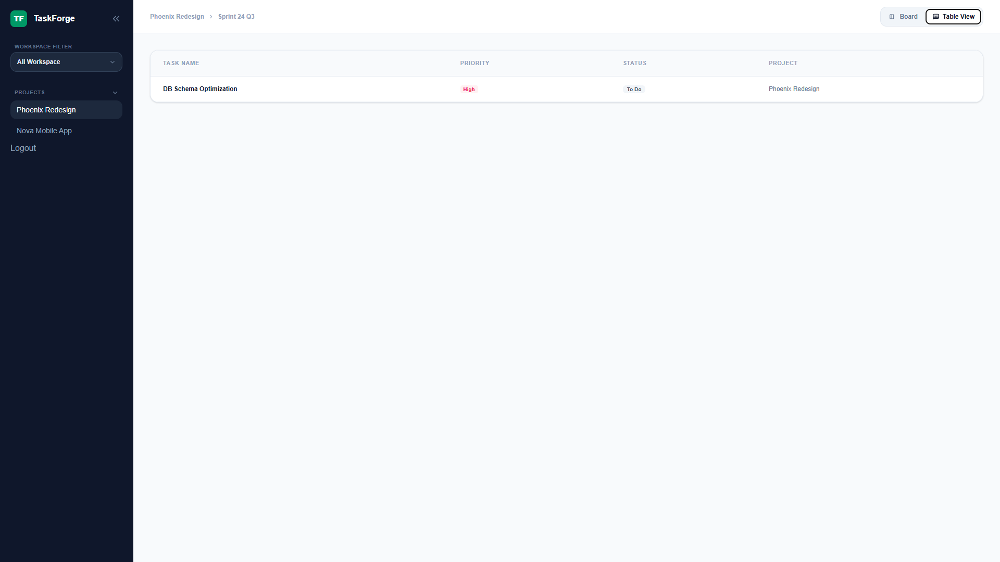
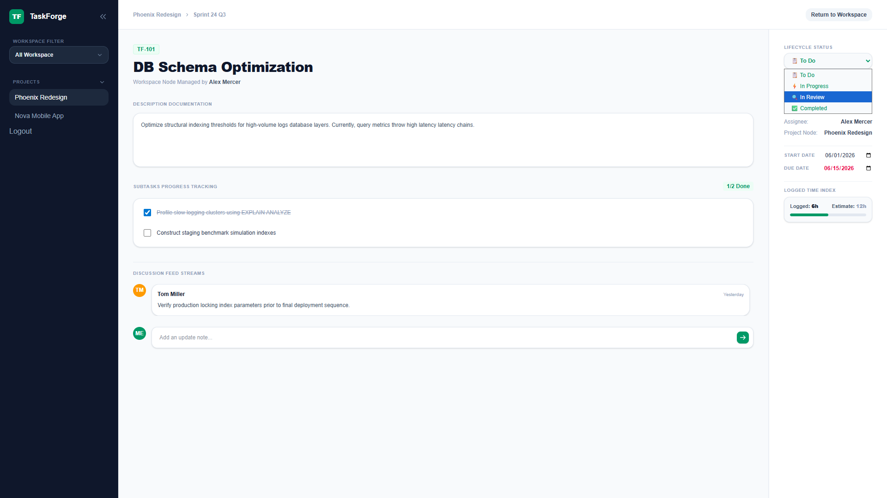

# TaskForge

A robust project management application built using modern .NET technologies.

## Technologies Used
- **Backend:** .NET 8, Entity Framework Core, MediatR, MongoDB, PostgreSQL (for event storage)
- **DDD (Domain-Driven Design), QR (Query Responsibility Segregation), SOLID Principles**
- **Containerization:** Docker, Docker Compose
- **Frontend:** Vite + React, TailwindCSS

## Getting Started

### Prerequisites

1. **Install .NET 8 SDK** from [here](https://dotnet.microsoft.com/download/dotnet/8.0).
2. **Docker Desktop** for Windows or Mac (Linux users can use Docker Engine).

### Project Setup

1. **Clone the repository:**
   ```sh
   git clone https://github.com/DucAnh-061020/TaskForge.git
   cd TaskForge
   ```
   
2. **Create Database Migrations (MongoDB & PostgreSQL):**
   For MongoDB:
   ```sh
   dotnet ef migrations add InitialCreate --project ./TaskForge.Infrastructure.Data --startup-project ./TaskForge.Api
   ```

3. **Run the application using Docker Compose:**
   Ensure Docker is running and execute the following command:
   ```sh
   docker-compose up --build
   ```
   or
   ```sh
   sudo docker-compose up --build
   ```
4. **Access the Swagger UI for API testing:**
   Open a browser and navigate to `http://localhost:5000/swagger`.

## Frontend

- **Tooling:** Vite + React, TailwindCSS.
- **Drag and Drop Task Management:** A user-friendly interface with interactive drag-and-drop functionality between boards.

## Testing








